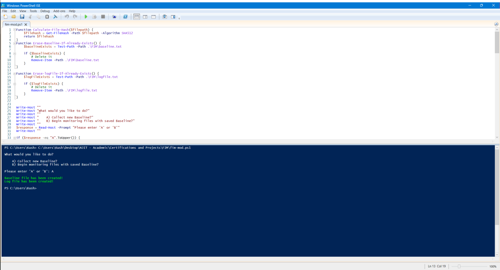

    <h1>PowerShell File Integrity Monitor (FIM) </h1>

 

  

 
This project is a PowerShell-based File Integrity Monitoring (FIM) system that allows users to create a baseline of file hashes, continuously monitor file changes against the baseline, and log any modifications, additions, or deletions of monitored files.

## Features

- Create a baseline of file hashes for a specified directory
- Continuously monitor files for changes against the saved baseline
- Detect and log new file creations, modifications, and deletions
- User-friendly prompts for choosing between collecting a new baseline or monitoring with a saved baseline

## Usage

1. Run the PowerShell script.
2. Choose one of the following options:
    - A) Collect a new Baseline
    - B) Begin monitoring files with a saved Baseline

### Collect a New Baseline

If you choose option A, the script will:

- Delete any existing baseline.txt and logfile.txt files.
- Create a new logfile.txt file to record file changes.
 
 

  

 

  

- Calculate the SHA512 hash of each file in the .\FIM\Files\ directory.
 
 

  

- Append the file path and hash to the baseline.txt file.

 

  

### Begin Monitoring with Saved Baseline

 

  

If you choose option B, the script will:

- Verify the integrity of the baseline.txt file.
- If the baseline.txt file is not compromised, load the file paths and hashes into a dictionary.
- Although, if the integrity of the baseline.txt file is compromised, the user is notified and the monitoring does not start.

 

  

- Enter a continuous loop that checks for file changes every 10 seconds:
    - Notify and log if a new file is created.
    - Notify and log if an existing file is modified.
    - Notify and log if a file from the baseline is deleted.
 
 

  

## Log File

The script creates a logfile.txt file in the .\FIM\ directory to record any file changes detected during monitoring. Each log entry includes the file path, the type of change (creation, modification, or deletion), and the timestamp of the change.

 

  

## Requirements

- Windows PowerShell

## Contributing

Contributions are welcome! Please feel free to submit bug reports, feature requests, or pull requests.
